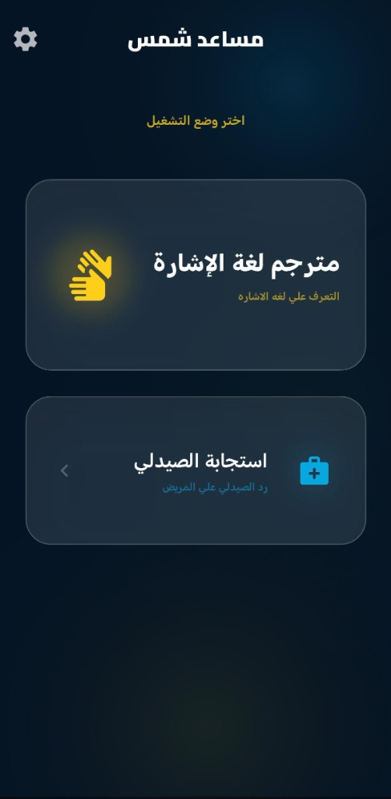
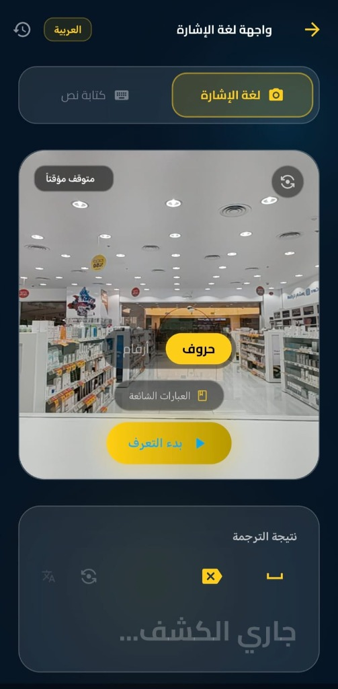
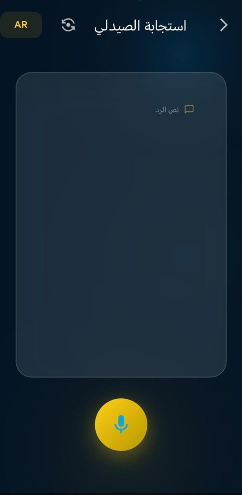
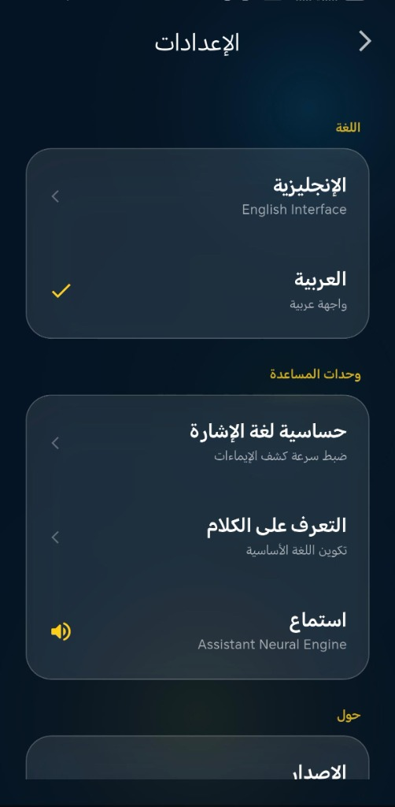

# ☀️ دليل المستخدم: مساعد شمس (Shams Assistant)

> [!NOTE]
> **مساعد شمس** هو رفيقك التقني الذكي المصمم لكسر حواجز التواصل وتسهيل التفاعل اليومي للأشخاص الصم وضعاف السمع والمكفوفين باستخدام تقنيات الذكاء الاصطناعي المتقدمة محلياً على جهازك.

---

## 📱 1. الشاشة الرئيسية (اختيار الوضع)
عند فتح التطبيق بعد شاشة الترحيب (Splash)، تظهر لك **شاشة اختيار الوضع (Mode Selector)** المصممة لتسهيل الوصول الفوري للأقسام الأساسية:
* **وضع الصم (Deaf Mode):** لترجمة لغة الإشارة إلى نصوص/أصوات.
* **وضع المكفوفين (Blind Mode):** للتوجيه والتفاعل الصوتي بالكامل.
* **وضع الصيدلي (Pharmacist Mode):** لتسهيل صرف الأدوية وتوضيح التعليمات الطبية.
* **وضع التدريب (Training Mode):** للتعلم التفاعلي للغة الإشارة.

---

## 🧏‍♂️ 2. وضع الصم (Deaf Mode)
يعتمد هذا الوضع على ترجمة لغة الإشارة العربية (حروفاً وأرقاماً) إلى نصوص مقروءة ومسموعة باستخدام كاميرا الهاتف المحمول ونماذج الذكاء الاصطناعي المدمجة.

### 📋 خطوات الاستخدام:
1. **تفعيل الوضع:** اختر "وضع الصم" من واجهة الخيارات الرئيسية.
2. **توجيه الكاميرا:** وجه كاميرا الهاتف نحو يديك بحيث تظهران بوضوح داخل إطار المعاينة.
3. **أداء الإشارة:** قم بعمل إشارة الحرف أو الرقم العربي، وسيقوم التطبيق بالتعرف عليها وعرض الترجمة فوراً على الشاشة.

---

## 🧑‍🦯 3. وضع المكفوفين (Blind Mode)
تم تصميم هذا القسم لمساعدة المكفوفين وضعاف البصر على التفاعل الكامل مع التطبيق والبيئة المحيطة.

### ✨ الخصائص الأساسية:
* **التوجيه الصوتي المستمر (Text-to-Speech):** يقوم التطبيق بقراءة جميع عناصر الواجهة والترجمات صوتياً.
* **الأوامر الصوتية الذكية:** إمكانية إصدار أوامر صوتية مباشرة للتنقل بين شاشات التطبيق دون الحاجة للمس.

---

## ⚕️ 4. وضع الصيدلي (Pharmacist Mode)
وضع تخصصي يُبسط قنوات التواصل بين الكادر الطبي (كالصيادلة) والمرضى من ذوي الاحتياجات الخاصة.

### ✨ الخصائص الأساسية:
* **إرشادات الأدوية:** توضيح الجرعات ومواعيد الدواء المكتوبة بلغة إشارية مبسطة أو مسموعة.
* **شاشات التواصل المشترك:** واجهة مزدوجة تضمن وضوح الفهم للطرفين (الصيدلي والمريض).

---

## 🎓 5. وضع التدريب (Training Mode)
دليلك التعليمي التفاعلي لتعلم وإتقان لغة الإشارة العربية.
* **مكتبة الإشارات:** تصفح الحروف والأرقام ومشاهدة طريقة أدائها الصحيحة.
* **التقييم الحي:** قم بتقليد الإشارة أمام الكاميرا ليقوم الذكاء الاصطناعي بتقييم أدائك وإعطائك نسبة دقة فورية لمساعدتك على التحسن.

---

## ⚙️ 6. الإعدادات (Settings)
لوحة تحكم كاملة لتخصيص تجربتك وتفضيلاتك:

* **حساسية الالتقاط:** تعديل سرعة استجابة التعرف على حركة اليد.
* **تحديث النماذج:** تنزيل وتثبيت أحدث إصدارات نماذج الذكاء الاصطناعي (TFLite).
* **إعدادات نبرة الصوت:** تخصيص سرعة ودرجة الصوت للتوجيهات الصوتية.

---

## 💡 نصائح ذهبية للأداء المثالي:

> [!TIP]
> **الإضاءة الجيدة:** احرص على استخدام التطبيق في مكان ذي إضاءة ساطعة وتجنب الإضاءة الخلفية القوية لضمان تتبع دقيق للمفاصل ونقاط اليد.

> [!IMPORTANT]
> **الخلفية الهادئة:** يفضل الوقوف أمام خلفية بلون موحد وغير مزدحمة لتقليل الضوضاء البصرية وزيادة سرعة الاستجابة.

---

## 📥 روابط التحميل والبدء:
* 📄 **[تحميل الدليل التفاعلي كاملاً كـ PDF](USER_GUIDE.html)** (افتح الصفحة التفاعلية واضغط زر "تحميل الدليل PDF" لتصديره وحفظه فوراً).
* 📱 **[تحميل تطبيق مساعد شمس الفعلي (APK)](https://drive.google.com/file/d/1RPszCVRTZfV_537SbJ_Sm3fvB1IXQnX1/view?usp=drivesdk)** (رابط مباشر عبر Google Drive).

---
*نتمنى لك تجربة تواصل رائعة ومثمرة مع مساعد شمس!* ☀️
